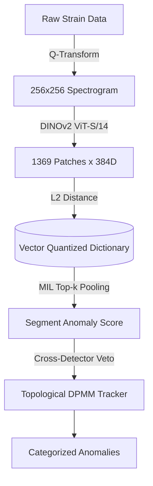

# DANTE: Domain-Adaptive Network for Transient Evaluation
> Unsupervised morphological characterization of gravitational-wave transients using frozen Vision Transformers and Multiple Instance Learning.

[](https://arxiv.org/abs/2605.28572)
[](https://doi.org/10.5281/zenodo.20960011)
[](LICENSE)
[](https://www.python.org/downloads/)



## 🚀 Quick Start
Minimum viable steps to execute the anomaly pipeline on public data.

```bash
# 1. Setup environment
git clone https://github.com/lucacirfeta/dante-gravi-signal-ml.git
cd dante-gravi-signal-ml
python -m venv .venv
source .venv/bin/activate
pip install -r requirements.txt

# 2. Download raw GWOSC strain data (L1, 72 hours)
python main.py fetch-raw --detector L1 --hours 72

# 3. Build the baseline memory dictionary (Vector Quantization)
python main.py build-patch-reference --detector L1

# 4. Run production inference (MIL Top-68 scoring)
python main.py patch-production --detector L1 --k 68 --batch-size 32

# 5. Cluster the discovered anomalies (DPMM)
python main.py production-cluster --detector L1
```

## 🔭 Scientific Context
LIGO detectors suffer from continuously drifting instrumental noise ("domain shift") between observing runs. Supervised models trained on historical data often collapse when deployed on new runs due to unseen noise topologies. DANTE circumvents this by modeling the steady-state background as a continuous manifold and detecting anomalies purely via unsupervised structural distance, requiring zero labeled data or fine-tuning. 
For deep physical and mathematical derivations, refer to the [arXiv preprint (2605.28572)](https://arxiv.org/abs/2605.28572).

## 🏗️ Architecture
- **Preprocessing:** 32-second whitened strain segments → Q-transform ($Q \in [4, 64]$) → $256 \times 256$ `cividis` spectrograms.
- **Feature Extraction:** Frozen DINOv2 ViT-S/14 yields 1369 overlapping patch embeddings ($384$D) per segment.
- **Background Dictionary:** VQ-clustered operational memory index ($K=1,216$ centroids) built from 150,000 null segments.
- **Anomaly Scoring:** Multiple Instance Learning (MIL) Top-$k$ pooling computes the mean $L_2$ distance of the $k=68$ most anomalous patches.
- **State Tracker:** Dirichlet Process Gaussian Mixture Model (DPMM) absorbs macroscopic state shifts dynamically.
- **Veto:** Cross-interferometer (H1/L1) cosine similarity matching across Top-$k$ patches suppresses localized artifacts.

## ⚙️ Reproducibility

### Hardware Requirements
- **Tested Configuration:** NVIDIA RTX 30XX/40XX series (16GB VRAM minimum for `batch_size: 64`), 64GB RAM, NVMe SSD (critical for HDF5 SWMR writes). Tested with **Python 3.10.12**.
- **Minimum Viable:** Any CPU (x86_64/ARM) or Apple Silicon (M1/M2/MPS). The pipeline auto-detects hardware and dynamically falls back to CPU if no accelerator is found. Default CUDA batch size is explicitly constrained to `32` to prevent Out-of-Memory (OOM) errors on consumer-grade GPUs. 
- **Blackwell GPUs (RTX 50XX):** Require PyTorch nightly builds (`cu128+`) for `sm_120` kernel support.

### Software Dependencies
The pipeline relies on strictly version-controlled libraries. See `requirements.txt` for the full list. Core dependencies include:
- `gwpy>=3.0.13` and `gwosc>=0.7.1` (Strain data ingestion)
- `torch>=2.1.0` and `torchvision>=0.16.0` (DINOv2 inference)
- `h5py>=3.10` (SWMR I/O for production scans)
- `scikit-learn>=1.3.0` and `umap-learn>=0.5.6` (HDBSCAN/DPMM clustering and projection)

### Data Access (GWOSC)
Raw O4a strain data is fetched programmatically from the Gravitational Wave Open Science Center (GWOSC). DANTE uses `gwpy` to stream the data automatically. 
> ⚠️ **RESTRICTED ACCESS FLAG:** While O4a data is being released publicly on GWOSC, low-latency auxiliary Physical Environment Monitoring (PEM) channels and sub-threshold zero-lag H1/L1 pairs used in the Cross-Detector Veto may require active LIGO Scientific Collaboration (LSC) computing credentials (e.g., access to `/cvmfs/` directories on CIT clusters). If you lack LSC credentials, the pipeline will gracefully fall back to processing public GWOSC open data.

### Pre-Computed Artifacts (Zenodo)
For immediate verification without re-running the feature extraction, the labeled benchmark sets and O4a reference indices are permanently hosted on Zenodo:
- **In-Domain Reference Index:** `10.5281/zenodo.5649212`
- **Gravity Spy Training Set:** `10.5281/zenodo.1476551`
- The pipeline will automatically fetch the necessary `.npz` indices if they are missing from `data/reference/`.

## 📊 Key Results
*Note: All empirical claims are strictly bounded by the conditions under which they were measured.*

- **O3b Benchmark Novelty Detection:** AUC > 0.98. 
  *(Conditions: Evaluated exclusively on the labeled O3b benchmark dataset, contrasting DINOv2 vs. ResNet baselines).*
- **Domain Shift Defense (DSD):** 0% false-recovery rate during macroscopic topological domain shifts (e.g., "Family_01").
  *(Conditions: Evaluated on 180 days of unlabelled O4a strain using frozen DINOv2, MIL Top-68 pooling, and adaptive threshold $\tau_{\rm op}^{\rm Det}$ calibrated at the 99th empirical percentile).*
- **Transient Recovery:** >95% efficiency for matched-filter SNRs $> 15$.
  *(Conditions: Synthetic injections of 5 morphologies—HarmonicComb, WallOfLines, ScatteredLight, KoiFish, Whistle—into real O4a noise).*
- **Cross-Session Connectivity:** ARI of 0.96 across 72 discontinuous observing sessions.
  *(Conditions: Measured via Single-linkage HAC on DPMM centroids with a cosine distance cutoff of 0.25).*

## 🛑 Limitations
1. **Computational Bottleneck:** The $Q$-transform and DINOv2 patch extraction are computationally intensive. DANTE operates strictly offline/high-latency and is **not** capable of real-time, low-latency multi-messenger alerting.
2. **Frequency Domain Truncation:** The $Q$-transform upper bound of 2048 Hz prevents characterization of ultra-high frequency anomalies.
3. **Patch-Size Blindness:** The Top-$k$ pooling parameter ($k=68$) is a strong prior tuned for extended transients. Extremely brief transients (e.g., micro-blips lasting $\mathcal{O}(1)$ ms) affecting $\ll 68$ patches are severely penalized (False Negatives). Lowering $k \le 8$ degrades specificity (False Positives).
4. **Detector Specificity:** Background indices must be constructed independently for each interferometer. An L1 index cannot be naively transferred to H1 without recalibration.

## 📝 Citation and License

Contributions are welcome. This project is open-source under the **Apache License 2.0**.
See [LICENSE](LICENSE) for details.

### Citation
If you use this software in your research, please cite our preprint:

```bibtex
@software{gravi_signal_ml_arxiv,
  title  = {DANTE: A Reference-Guided Unsupervised Pipeline for Extended-Transient Anomaly Characterization in LIGO O4a},
  author = {Cirfeta, Luca},
  year   = {2026},
  eprint = {2605.28572},
  archivePrefix = {arXiv},
  primaryClass = {astro-ph.IM},
  doi    = {10.5281/zenodo.20960011},
  url    = {https://arxiv.org/abs/2605.28572}
}
```

### LLM Disclosure
The authors acknowledge the use of Large Language Models (LLMs) for linguistic polishing and code debugging during the preparation of this repository and the associated manuscript. All scientific concepts, data analysis, physical interpretations, and final conclusions were performed entirely by the authors.
