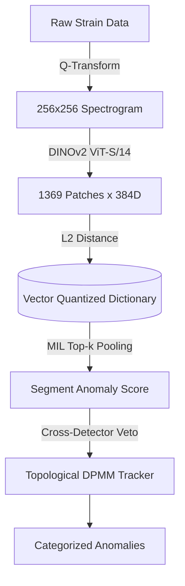

# DANTE: Domain-Adaptive Network for Transient Evaluation
> Unsupervised morphological characterization of gravitational-wave transients using frozen Vision Transformers and Multiple Instance Learning.

[](https://arxiv.org/abs/2607.18136)
[](https://doi.org/10.5281/zenodo.21912589)
[](LICENSE)
[](https://www.python.org/downloads/)



## 🚀 Quick Start
Minimum viable steps to execute the anomaly pipeline on public data.

```bash
# 1. Setup environment
git clone https://github.com/lucacirfeta/dante-gravi-signal-ml.git
cd dante-gravi-signal-ml
python -m venv .venv
source .venv/bin/activate
pip install -r requirements-cpu.txt  # portable CPU reference

# 2. Download raw GWOSC strain data (L1, 72 hours)
python main.py fetch-raw --detector L1 --hours 72

# 3. Verify immutable model/index inputs. The software and paper-evidence
#    Zenodo records do NOT contain the NPZ dictionaries. See R1/R2/R3 below;
#    a missing artifact fails instead of being guessed.
python scripts/manage_reference_artifacts.py acquire-model
python scripts/manage_reference_artifacts.py verify
# Required index names:
#   data/reference/patch_compressed_index_o3b.npz          (O3b, K=275)
#   data/reference/patch_compressed_index_o4a_q4-64_ex.npz (O4a, K=1216)
# Verify your setup before going further (takes ~10 s):
pytest -m smoke

# 4. Full per-session pipeline (production -> clustering -> report -> validation)
python main.py patch-analysis --detector L1 --data-dir data/raw/o4a --resume

# 5. (modular alternative) inference and clustering as separate steps
#    python main.py patch-production --detector L1 --k 68 --batch-size 32
#    python main.py production-cluster --detector L1

# 6. Aggregate cross-session reports, stability analysis, final report
python main.py aggregate-report --run O4a

# 6b. V3 multiscale characterization of the aggregated candidates
python main.py multiscale-analysis --run O4a

# 7. Perform PEM coherence analysis on the candidates
# (Ensure data/production_reference/channel_thresholds.json is present)
#
# REQUIRES the NDS2 client, which pip cannot install — this step is the one
# part of the pipeline that does not run in the venv above:
#     conda install -c conda-forge nds2-client python-nds2-client
# Without it gwpy reports every auxiliary channel as "no valid sources found",
# which looks identical to a genuine coverage gap. The pipeline now detects
# this and refuses rather than producing a report full of false absences.
python main.py pem-coherence-analysis --run O4a \
  --robust-events 21 --ambiguous-events 20 --background-events 98 \
  --reuse-existing-dir data/production/aggregated/pem \
  --nds-host nds.gwosc.org

# 7b. Family-wise empirical null for the PEM veto. Each event pulls ~0.5 GB of
#     auxiliary background, purged once its null is computed; pass --keep-cache
#     only if you are re-running events that share a background span.
python -m src.pipeline_v2_production.pem_null_calibration --run O4a \
  --pem-dir data/production/aggregated/pem/idxq4-64_queryq4-64

# 7c. Measure where the DSD stops seeing a morphology. The native index is built
#     from the run's own background, so a morphology common enough there is
#     learned by the dictionary and re-scored as background by construction.
#     This sweeps injected prevalence against a same-size all-background control.
python main.py dsd-absorption --morphology Blip

# 7d. Does any morphology recur across widely separated sessions, as a glitch
#     class would and noise would not? Uses the stored MIL vectors.
python main.py inter-session-recurrence --run O4a

# 7e. Robustness & characterization suite (reviewer-driven, standalone). Runs
#     AFTER aggregate-report; each writes a JSON + provenance record to
#     data/production/aggregated/ and is covered by the smoke test. Full order
#     and prerequisites in CLI_REFERENCE.md → "Execution Order".
python main.py dsd-threshold-mc-error --run O4a        # R3: DSD threshold MC error — PREREQUISITE of the rest
python main.py dsd-index-stability --run O4a           # survivors vs background draw (P5); writes token cache
python main.py dsd-k-sensitivity --run O4a             # survivors vs dictionary size K (P4); needs the P5 cache
python main.py pca-baseline --run O4a                  # what the encoder buys vs a classical baseline (P10)
python main.py catalog-cross-match --run O4a           # overlap vs circular-shift null (P11; not recall)
python main.py blind-spot-map --run O4a                # empirical time-frequency blind-spot map
python main.py whitening-context-sensitivity --run O4a # DSD verdict flips vs whitening context

# 7f. On demand, any single candidate: independent descriptors (peak frequency,
#     loudness ratio, raw cross-detector correlation), deliberately NOT reusing
#     production preprocessing. --catalog-gps looks up the authoritative
#     production coincidence veto alongside, without conflating the two.
#     Recipe adapted from an independent reproduction by GitHub user Kretski.
python main.py characterize-candidate --detector L1 --gps <gps> \
    --feature-gps <feature_gps> --band 26 42 --catalog-gps <catalog_gps>

# 8. Calculate Poisson Upper Limit for null-result periods
python main.py poisson-upper-limit
```

## 🔭 Scientific Context
LIGO detectors suffer from continuously drifting instrumental noise ("domain shift") between observing runs. Supervised models trained on historical data often collapse when deployed on new runs due to unseen noise topologies. DANTE circumvents this by modeling the steady-state background as a continuous manifold and detecting anomalies purely via unsupervised structural distance, requiring zero labeled data or fine-tuning. 
For deep physical and mathematical derivations, refer to the [arXiv preprint (2607.18136)](https://arxiv.org/abs/2607.18136).

## 🏗️ Architecture
- **Preprocessing:** 32-second whitened strain segments → Q-transform ($Q \in [4, 64]$) → $256 \times 256$ `cividis` spectrograms.
- **Feature Extraction:** Frozen DINOv2 ViT-S/14 yields 1369 overlapping patch embeddings ($384$D) per segment.
- **Background Dictionary:** VQ-clustered operational memory index — **$K=275$ centroids** for canonical O3b discovery and **$K=1216$** for coherent O4a-native DSD. Each file has its own SHA-256/shape/Q-range contract in `config/reference_artifacts.json`.
- **Anomaly Scoring:** Multiple Instance Learning (MIL) Top-$k$ pooling computes the mean $L_2$ distance of the $k=68$ most anomalous patches.
- **State Tracker:** Dirichlet Process Gaussian Mixture Model (DPMM) absorbs macroscopic state shifts dynamically.
- **Veto:** Cross-interferometer (H1/L1) cosine similarity matching across Top-$k$ patches suppresses localized artifacts. State machine: `ACTIVE_UNVERIFIED` (partner recording, search pending) is never conflated with `ACTIVE_NO_ANOMALY` (search ran, no match) or `UNOBSERVABLE` (no partner data); I/O failures route to *unverifiable*, never to *confirmed local*.
- **V3 Multiscale Characterization:** V2 candidates are re-scored at {0.5, 1, 2, 4} s scales against per-scale background dictionaries (`multiscale-analysis`), yielding a score-vs-scale duration profile per candidate. By design V3 is a characterization layer, **not** a second discovery trigger (no OR-fusion of per-scale flags → no multiple-testing inflation on discovery claims).

## ⚙️ Reproducibility

### Hardware Requirements
- **Tested Configuration:** NVIDIA RTX 30XX/40XX series (16GB VRAM minimum for `batch_size: 64`), 32GB+ RAM (WSL cap >=30GB required for 10k-candidate aggregation), NVMe SSD (critical for HDF5 SWMR writes). Tested with **Python 3.10.12**.
- **Minimum Viable:** Any CPU (x86_64/ARM) or Apple Silicon (M1/M2/MPS). The pipeline auto-detects hardware and dynamically falls back to CPU if no accelerator is found. Default CUDA batch size is explicitly constrained to `32` to prevent Out-of-Memory (OOM) errors on consumer-grade GPUs. 
- **Blackwell GPUs (RTX 50XX):** Require PyTorch nightly builds (`cu128+`) for `sm_120` kernel support.

### Software Dependencies
See `requirements.txt` for the full list. Core dependencies include:
- `gwpy>=3.0.13` and `gwosc>=0.7.1` (Strain data ingestion)
- `torch>=2.1.0` and `torchvision>=0.16.0` (DINOv2 inference)
- `h5py>=3.10` (SWMR I/O for production scans)
- `scikit-learn>=1.3.0` and `umap-learn>=0.5.6` (HDBSCAN/DPMM clustering and projection)

> ℹ️ **Reproducing a published score: use `[gps + 4, gps + 36]`.** The pipeline is
> deterministic and its stored scores reproduce **exactly**, but catalogues written
> before 2026-07-24 label each candidate with the start of the *padded crop*, four
> seconds before the window actually analysed. Re-scoring `[gps, gps+32]` analyses a
> window shifted by 4 s and misses by ~0.07 in score; `[gps + 4, gps + 36]` reproduces
> the archived value to four decimal places. Runs from 2026-07-24 onward label the
> analysis window directly.
>
> An earlier version of this note blamed `gwpy` major-version drift. That was tested
> directly and is **false**: `gwpy` 3.0.13 and 4.0.1 give spectrograms agreeing to
> 4.7e-10 and identical scores to six decimals, and the same score is returned on CPU,
> on GPU, and with TF32 disabled. `requirements-lock.txt` is still worth using, and every
> run now writes an `environment_*.json` beside its artifacts, but neither was the cause.

**Every run now records its own provenance.** Scanning, per-session reporting and cross-session aggregation each write an `environment_*.json` next to their outputs, holding the installed package set, source state and reference-index hashes. New scoring HDF5 files record SHA-256 and retain MD5 only for resume compatibility with older files. Quote the adjacent environment record, not `requirements.txt`, when reporting where a number came from.

### Data Access (GWOSC)
Raw O4a strain data is fetched programmatically from the Gravitational Wave Open Science Center (GWOSC). DANTE uses `gwpy` to stream the data automatically. 
> ⚠️ **RESTRICTED ACCESS FLAG:** While O4a strain is public on GWOSC, Physical
> Environment Monitoring (PEM) channel coverage varies and some channels may
> require collaboration access. Missing NDS2 software is treated as an error,
> never as a physical coverage gap. A strain-only null-result mode is explicitly
> labelled and cannot produce a PEM coupling verdict.

### Reference inputs (Zenodo)
The public source datasets used to construct and benchmark reference indices are:
- **Gravity Spy O1--O3 classifications:** `10.5281/zenodo.5649212`
- **Gravity Spy image training set (legacy benchmark):** `10.5281/zenodo.1476551`

These records do **not** contain DANTE's validated `.npz` dictionaries. Neither
the v3.7.0 software record (`10.5281/zenodo.21912589`) nor the v6 paper-evidence
record (`10.5281/zenodo.21925453`) bundles them. Exact canonical scoring requires
the separate
[`dante_reference_artifacts_v1.zip`](https://github.com/lucacirfeta/dante-gravi-signal-ml/releases/download/dante-reference-artifacts-v1/dante_reference_artifacts_v1.zip),
published with SHA-256
`651a70dbf3798de8caba91f1117879cf1798581f1fd949cabf12e260d100fa63`.
See [`docs/REPRODUCIBILITY_LEVELS.md`](docs/REPRODUCIBILITY_LEVELS.md).

## DANTE-Light (experimental, opt-in)

DANTE-Light is an additive exact-replay and detector-characterisation triage
layer. It does not replace the validated offline pipeline and cannot emit the
offline `ROBUST`, `AMBIGUOUS`, or `BACKGROUND` dispositions. Its vocabulary is
limited to `ESCALATE`, `AUDIT_SAMPLE`, `NOT_ESCALATED`, and scoreless `DEFER`.

The canonical reference engine remains the default:

```bash
python main.py dante-light-replay \
  --output-dir runs/dante_light/tutorial \
  --role background_stratified --limit 8 \
  --engine canonical --cat1-mode gwosc --strain-source gwosc-only
```

The exact shared-encoder engine is explicitly opt-in:

```bash
python main.py dante-light-replay \
  --output-dir runs/dante_light/tutorial_fast \
  --role background_stratified --limit 8 \
  --engine shared_encoder_score_only --cat1-mode gwosc \
  --strain-source gwosc-only
```

On the clean paired RTX 5070 benchmark it increased throughput by about 12.9%
while preserving primary/native scores; this is a host-specific engineering
measurement, not a universal speed claim. Every run writes a separate
`run_manifest.json`, append-only `records.jsonl`, `attempts.jsonl`, and
`summary.json`. Repeating the same command resumes without duplicate window
identities; changing code, representation, epochs, selection, or CAT1 mode
requires a new output directory.

The shipped O4a BGV3 epoch is explicitly historical and non-causal. Therefore
`dante-light-shadow` produces `DEFER/NON_CAUSAL_EPOCH` until a detector-specific
past-only epoch is independently promoted. `NOT_ESCALATED` is a triage outcome,
never a physical background classification. See
[`docs/DANTE_LIGHT.md`](docs/DANTE_LIGHT.md) for installation, CPU/GPU replay,
failure meanings, resume, artifacts, and escalation to the full pipeline.

## 📊 Key Results
*Note: All empirical claims are strictly bounded by the conditions under which they were measured.*

> **v6 detector-aware audit:** the final coherent Q64/Q64 taxonomy contains
> 10,429 detector--GPS keys: 6,365 ROBUST, 1,275 AMBIGUOUS and 2,789 BACKGROUND.
> Of 10,372 historical paired keys, 4,676 dispositions change under the coherent
> representation; 57 detector-specific keys were restored. These are statistical
> DSD dispositions, not physical glitch classes.

- **O3b Benchmark Novelty Detection:** AUC > 0.98. 
  *(Conditions: Evaluated exclusively on the labeled O3b benchmark dataset, contrasting DINOv2 vs. ResNet baselines).*
- **Coherent Domain Shift Defense:** Q=[4,64] is enforced for both native index
  and queries; the production-scale native index has K=1216 and SHA256
  `0241b2a1ea2a460334f2c7ae0ab1bb62052706ea05c48443af32ae60a2488744`.
  The historical Q32/Q64 class columns remain available only for transition
  audit.

- **Methodological Upper Limit (post-audit, 2026-07):** $R_{90} < 5.83 \text{ yr}^{-1}$ for H1 ($N=0$, 144.2 d) and $R_{90} < 5.63 \text{ yr}^{-1}$ for L1 ($N=0$, 149.4 d) on morphologically novel transients.
  *(Conditions: 42-session O4a production; livetime gated on `{DET}_CBC_CAT1` science segments — less optimistic by construction than the deprecated span-based values (3.70/6.52 yr⁻¹ over ~227/218-day bounding spans), which used an ungated denominator.)*
- **PEM endpoint:** in the fixed 141-event measured cohort, 8 class transitions
  occur after detector-aware rejoining; the robust-vs-background Fisher test is
  p=1.0. This resolves no class enrichment and is not evidence of equal coupling
  rates or of absence in unmeasured channels.

## 🧪 Scientific Integrity Guarantees
Every experimentally-validated invariant of the pipeline is protected by a regression test (`tests/test_regression_hard_constraints.py` + `tests/test_norm_leakage_units.py`, 36 tests). Highlights:

- **Whitening:** `whiten()` on exactly-cropped segments is *forbidden at runtime* (raises); only `whiten_context()` (pad = 4 s, crop after) is legal. Bandpass is applied exactly once, inside `whiten_context` — a static test scans the whole codebase for double-bandpass reintroduction.
- **Statistics:** empirical p99 thresholds with aligned temporal-block bootstrap
  (b = n^{1/3}, B = 1000, seed = 42); GEV/block-maxima fitting is explicitly
  rejected. The Q64 threshold JSON identifies the exact score arrays and
  representation used.
- **Per-run calibration:** threshold files carry a `calibration_run` tag; applying thresholds across observing runs raises (`assert_threshold_run`), except in explicitly-declared cross-run measurement scripts. The 2026-07 leakage investigation (pre-registered, falsified the per-image-normalization hypothesis, and re-measured cross-run FPR at 0.7–2.9 % vs the 8–9 % artifact of the pre-audit code) is archived under `results/norm_leakage/`.
- **Reports:** the Final Discovery Report is run-parametric (`Master_Taxonomy_<run>.csv`, no hardcoded epochs) and self-declaring: any missing/degraded input is listed in a completeness block at the top — a hollow report cannot masquerade as a null result.
- **Multi-run support:** new observing runs (O5, …) require declared GPS bounds,
  a newly calibrated native index added to the artifact manifest, per-run
  thresholds and `tau_coh`. Missing contracts fail loudly; future readiness is
  not inferred from a run label alone.
- **Unsafe PEM channels:** `PEM-EX_VMON` / `PEM-EY_MAINSMON` (23 % empirical FPR on time-shifted background) are excluded from production `AUX_CHANNELS` and guarded by test; PEM skips are always logged, never silent.

## 🛑 Limitations
1. **Computational Bottleneck:** The $Q$-transform and data access dominate the current exact replay. DANTE-Light is an experimental nearline/shadow engineering path, not a validated real-time multi-messenger alert system.
2. **Frequency Domain Truncation:** 2048 Hz is requested, but GWpy clamps the
   realized upper Q-transform axis to about 1291.05 Hz for the production
   32-second, 4096-Hz, Q=[4,64] configuration.
3. **Patch-Size Blindness:** The Top-$k$ pooling parameter ($k=68$) is a strong prior tuned for extended transients. Extremely brief transients (e.g., micro-blips lasting $\mathcal{O}(1)$ ms) affecting $\ll 68$ patches are severely penalized (False Negatives). Lowering $k \le 8$ degrades specificity (False Positives).
4. **Detector Specificity:** Background indices must be constructed independently for each interferometer. An L1 index cannot be naively transferred to H1 without recalibration.

## 📝 Citation and License

Contributions are welcome. This project is open-source under the **Apache License 2.0**.
See [LICENSE](LICENSE) for details.

### Citation
If you use this software in your research, please cite our preprint:

```bibtex
@misc{dante_v3_arxiv,
  title  = {An Unsupervised Search for Novel Instrumental Glitches in LIGO O4a:
            Multi-Scale Sensitization, Empirical Physical Vetoes, and Rate Upper Limits},
  author = {Cirfeta, Luca},
  year   = {2026},
  eprint = {2607.18136},
  archivePrefix = {arXiv},
  primaryClass = {astro-ph.IM},
  url    = {https://arxiv.org/abs/2607.18136}
}
```

To cite the archived software and analysis artifacts:

```bibtex
@software{dante_v3_zenodo,
  title     = {DANTE (Domain-Adaptive Network for Transient Evaluation)},
  author    = {Cirfeta, Luca},
  year      = {2026},
  version   = {3.7.0},
  doi       = {10.5281/zenodo.21912589},
  publisher = {Zenodo},
  url       = {https://doi.org/10.5281/zenodo.21912589}
}
```

> The exact version used for every number in the manuscripts is pinned at git
> tag [`3.7.0`](https://github.com/lucacirfeta/dante-gravi-signal-ml/tree/3.7.0).

### LLM Disclosure
The authors acknowledge the use of Large Language Models (LLMs) for linguistic polishing and code debugging during the preparation of this repository and the associated manuscript. All scientific concepts, data analysis, physical interpretations, and final conclusions were performed entirely by the authors.
